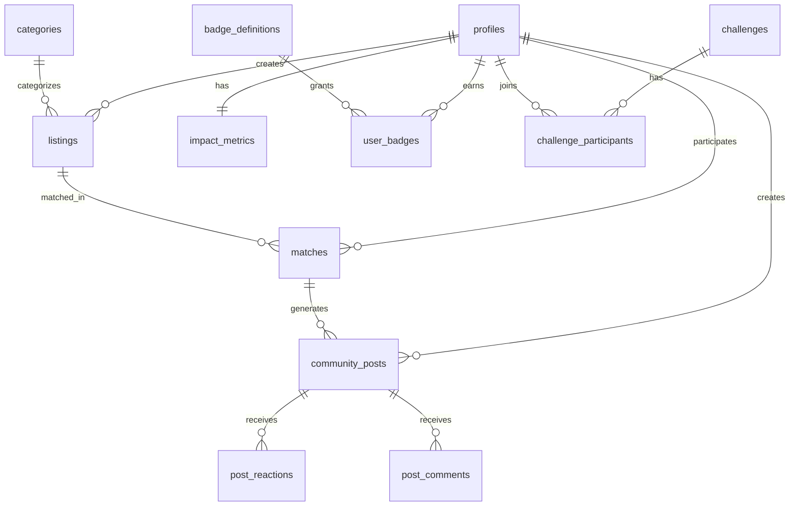

# Database Schema Documentation

## Overview

This SQL schema provides a complete database structure for the Eco-Bloom circular economy platform. It supports all features including material listings, matchmaking, sustainability tracking, gamification, leaderboards, challenges, and community engagement.

---

## Quick Setup

### 1. Run the Schema Script

1. Go to your Supabase Dashboard: `https://supabase.com/dashboard/project/yhbfdplcwizmdvemanci`
2. Navigate to **SQL Editor**
3. Create a new query
4. Copy the entire contents of `database/schema.sql`
5. Paste and click **Run**

> [!IMPORTANT]
> The script will create all tables, set up Row Level Security (RLS), create triggers, and initialize default data.

### 2. Verify Installation

After running the script, check the **Table Editor** to verify these tables were created:
- `profiles`
- `listings`
- `matches`
- `impact_metrics`
- `categories`
- And 10+ more...

---

## Database Structure

### Core Tables

#### 1. **profiles**
Extends Supabase `auth.users` with user profile data and gamification stats.

**Key Fields:**
- `full_name`, `username`, `avatar_url`, `bio`
- `organization_name`, `organization_type`
- `location`, `location_coords` (PostGIS geography for geo-matching)
- `level`, `level_number`, `total_points`
- `current_streak`, `longest_streak`

**Auto-created** when user signs up via trigger.

#### 2. **categories**
Material categories (Organic, Textiles, Plastics, etc.)

**Pre-seeded** with 6 default categories.

#### 3. **listings**
User-created material offerings or needs.

**Key Fields:**
- `type`: 'offering' or 'seeking'
- `category_id`: References categories
- `title`, `description`
- `quantity`, `unit`, `frequency`
- `location`, `location_coords`
- `status`: 'active', 'matched', 'completed', 'cancelled'

#### 4. **matches**
Connections between offering and seeking listings.

**Key Fields:**
- `offering_listing_id`, `seeking_listing_id`
- `offering_user_id`, `seeking_user_id`
- `matched_quantity`, `unit`
- `status`: 'pending', 'accepted', 'in-progress', 'completed'
- **Impact metrics:** `co2_saved_kg`, `materials_diverted_kg`, `water_conserved_liters`

---

### Impact & Scorecard

#### 5. **impact_metrics**
Aggregate sustainability metrics per user.

**Cumulative Metrics:**
- `total_co2_saved_kg`
- `total_materials_diverted_kg`
- `total_water_conserved_liters`
- `total_matches`
- `trees_equivalent` (auto-calculated: CO₂ saved / 21.772)

**Time-based Metrics:**
- Week and month totals for all metrics

#### 6. **impact_history**
Daily impact tracking for charts and visualizations.

**Fields:** `date`, `co2_saved_kg`, `materials_diverted_kg`, `water_conserved_liters`

---

### Gamification

#### 7. **badge_definitions**
Available badges and their unlock criteria.

**Pre-seeded Badges:**
- First Seed (1 match)
- Week Warrior (7-day streak)
- Carbon Crusher (1 ton CO₂)
- Community Builder (10 matches)
- Forest Guardian (100 trees equivalent)
- Ocean Protector (10,000L water)

#### 8. **user_badges**
Tracks which badges users have earned.

**Fields:**
- `badge_id`, `earned_at`
- `progress`: For tracking partial progress

#### 9. **leaderboard_rankings**
Cached rankings updated periodically.

**Periods:** 'week', 'month', 'all-time'

**Metrics:** `rank`, `points`, `matches_count`, `co2_saved_kg`

---

### Community Features

#### 10. **challenges**
Time-limited community challenges.

**Types:** materials, matches, co2, water, category-specific

**Fields:**
- `title`, `description`, `icon`
- `target_value`, `current_value`, `unit`
- `points_reward`, `badge_reward_id`
- `starts_at`, `ends_at`
- `participant_count`

#### 11. **challenge_participants**
Tracks user participation in challenges.

#### 12. **community_posts**
Social feed posts about matches and achievements.

**Engagement:** `reactions_count`, `comments_count`, `shares_count`

#### 13. **post_reactions** & **post_comments**
User interactions with posts.

#### 14. **community_goals**
Long-term collective objectives.

**Examples:**
- Million Kg Challenge
- Carbon Neutral City
- 10K Businesses

---

### Location Features

#### 15. **eco_locations**
Map nodes for businesses, hubs, and active users.

**Uses PostGIS** for geographic queries and proximity matching.

---

## Row Level Security (RLS)

All tables have RLS enabled with policies for:

✅ **Public Read**: Profiles, listings, posts are visible to all
🔒 **User-owned Write**: Users can only modify their own data
🔒 **Match Permissions**: Users can only view matches they're part of

### Example Policies

```sql
-- Users can view ALL profiles
FOR SELECT USING (true)

-- Users can ONLY update THEIR OWN profile
FOR UPDATE USING (auth.uid() = id)

-- Users can ONLY view matches they're involved in
FOR SELECT USING (auth.uid() = offering_user_id OR auth.uid() = seeking_user_id)
```

---

## Triggers & Auto-Functions

### 1. Auto-create Profile on Signup
When a user signs up via Supabase Auth:
- Profile is automatically created in `profiles` table
- Impact metrics initialized
- Uses `full_name` from auth metadata

### 2. Auto-update Timestamps
`updated_at` field automatically updated on row modification.

### 3. Streak Tracking
`update_user_streak()` function manages daily activity streaks.

---

## Indexes for Performance

Optimized indexes created for:
- User lookups (`username`, `location_coords`)
- Listing searches (`category`, `type`, `status`, `location`)
- Match queries (`user_id`, `status`, `created_at`)
- Leaderboard rankings (`period`, `rank`)
- Community feed (`created_at` DESC for timeline)

**Geographic Indexes** using PostGIS GIST for proximity searches.

---

## PostGIS for Location Features

The schema uses **PostGIS extension** for geographic data:

```sql
CREATE EXTENSION IF NOT EXISTS "postgis";
```

**Geography columns:**
- `location_coords GEOGRAPHY(POINT, 4326)`

**Benefits:**
- Distance-based matching (find nearby listings)
- Map visualization
- Eco-map location clustering

**Example Query:**
```sql
-- Find listings within 10km
SELECT * FROM listings
WHERE ST_DWithin(
  location_coords,
  ST_MakePoint(longitude, latitude)::geography,
  10000  -- meters
);
```

---

## Next Steps After Setup

### 1. Test Data (Optional)

You can insert test data for development:

```sql
-- Create test listings
INSERT INTO listings (user_id, type, category_id, title, description, quantity, unit, frequency, location)
VALUES (
  auth.uid(),
  'offering',
  (SELECT id FROM categories WHERE slug = 'organic'),
  'Fresh Coffee Grounds',
  'Daily supply from our café',
  5,
  'kg',
  'daily',
  'San Francisco, CA'
);
```

### 2. Connect to Frontend

Update your Supabase client queries to use these tables:

```typescript
// Fetch active listings
const { data: listings } = await supabase
  .from('listings')
  .select(`
    *,
    category:categories(*),
    profile:profiles(full_name, avatar_url, level)
  `)
  .eq('status', 'active')
  .order('created_at', { ascending: false });
```

### 3. Set up Realtime (Optional)

Enable realtime for specific tables in Supabase Dashboard:
- Database → Replication → Enable for `community_posts`, `matches`

---

## Schema Diagram



---

## Maintenance

### Weekly Tasks
- Recalculate leaderboard rankings
- Update challenge progress
- Archive old matches

### Monthly Tasks
- Reset monthly metrics
- Award monthly challenge badges
- Update community goal progress

### Suggested Cron Jobs

```sql
-- Reset weekly metrics (run every Monday)
UPDATE impact_metrics
SET week_co2_saved_kg = 0,
    week_materials_kg = 0,
    week_water_liters = 0;

-- Update leaderboard (run daily)
-- (create function to recalculate rankings based on points)
```

---

## Troubleshooting

### Issue: "relation already exists"
**Solution:** Drop existing tables or skip to specific sections

### Issue: RLS blocking queries
**Solution:** Check policies in Dashboard → Authentication → Policies

### Issue: PostGIS functions not found
**Solution:** Ensure PostGIS extension is enabled:
```sql
CREATE EXTENSION IF NOT EXISTS "postgis";
```

---

## Summary

This schema provides:
✅ Complete user profile management
✅ Material listing & matching system
✅ Impact tracking & scorecard
✅ Gamification (badges, levels, streaks)
✅ Leaderboards & challenges
✅ Community feed & social features
✅ Geographic matching capabilities
✅ Row-level security
✅ Optimized performance with indexes

**Ready for production use** with proper security, scalability, and feature completeness!
